NOTICE: This project was originally developed by a chatbot. I’ve still put in considerable effort fixing logic issues, resolving bugs, and contributing feature ideas to ensure everything works properly.

🎓 Student Marks Tracking & Analysis System
NOTICE: This project was originally developed by a chatbot. Ive still put in considerable effort fixing logic issues, resolving bugs, and contributing feature ideas to ensure everything works properly.
A Django web application for managing, analyzing, and visualizing student exam performance.

📊 Dashboard
The dashboard provides an overview of all key metrics:
•	Total exams, subjects, and students
•	Leaderboards (marks, average, points)
•	Recent exams table
•	Subject and exam type summaries
•	Grade distribution and subject performance charts
How it works:
Monitor overall progress, top performers, and trends at a glance.

**Screenshots:**
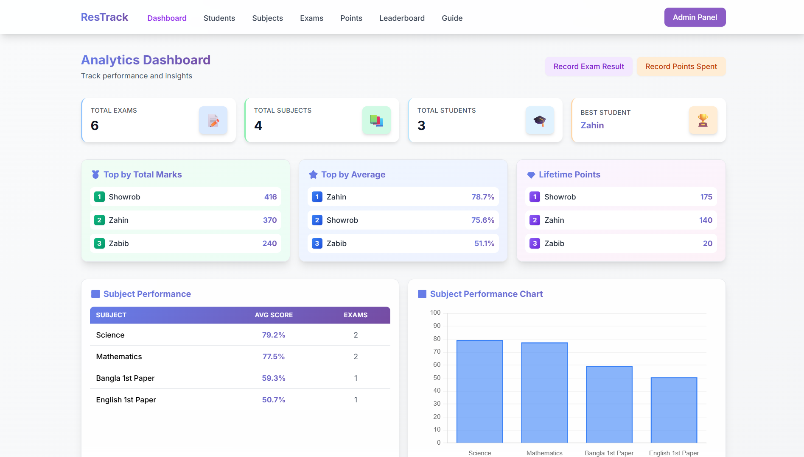
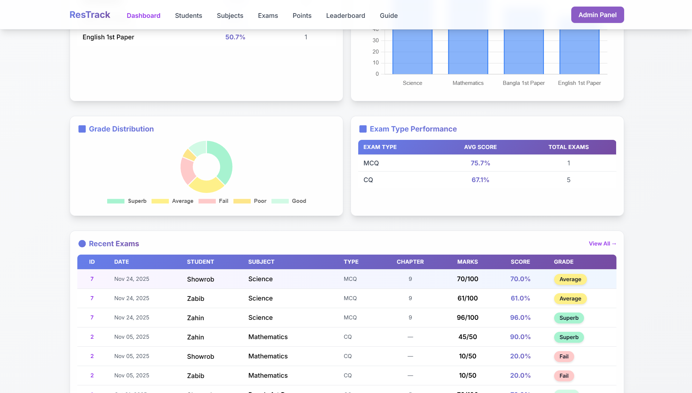

👥 Students List
Shows all students with their basic stats:
•	Name, class, roll
•	Rank, total marks, average percentage
How it works:
Browse or search for students. Click a student's name for their detailed profile.

**Screenshot:**
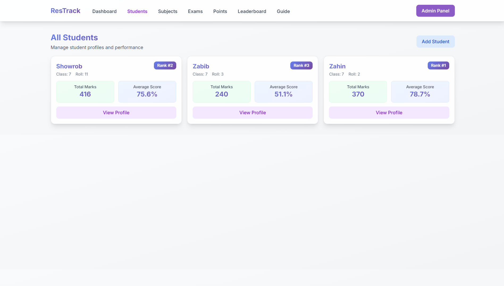

🧑🎓 Student Profile
Detailed analytics for an individual student:
•	Personal info and overall stats
•	Lifetime points and rank
•	Subject-wise and exam-type summaries
•	Recent exams history
•	Interactive charts (marks over time, grade distribution, etc.)
How it works:
Track a student's progress, strengths, and weaknesses. Use charts to visualize performance trends.

**Screenshots:**
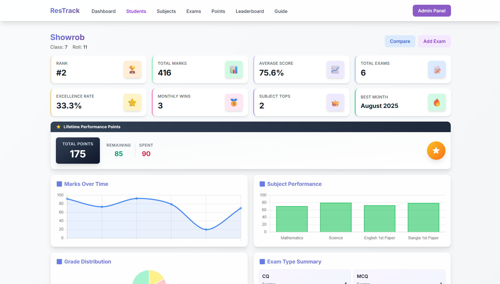
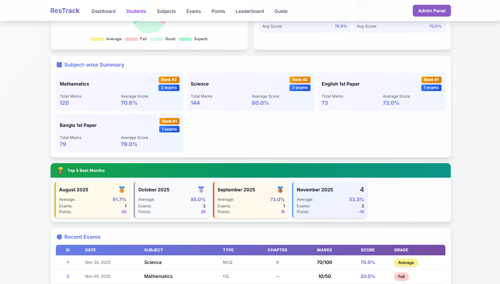
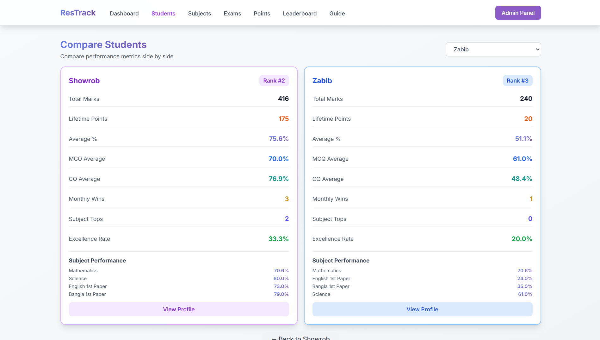

📚 Subjects List
Lists all subjects with:
•	Average performance
•	Total exams per subject
How it works:
See which subjects are most challenging or have the best results. Click a subject for more details.

**Screenshot:**
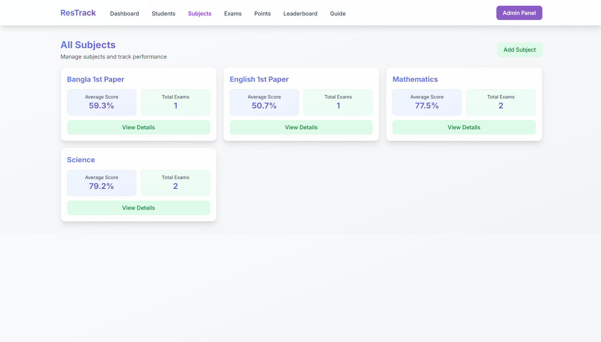

📝 Subject Details
Detailed analytics for a specific subject:
•	Best performing student
•	Student comparison chart
•	Performance rankings
How it works:
Analyze how students perform in a subject, compare results, and identify top achievers.

**Screenshot:**
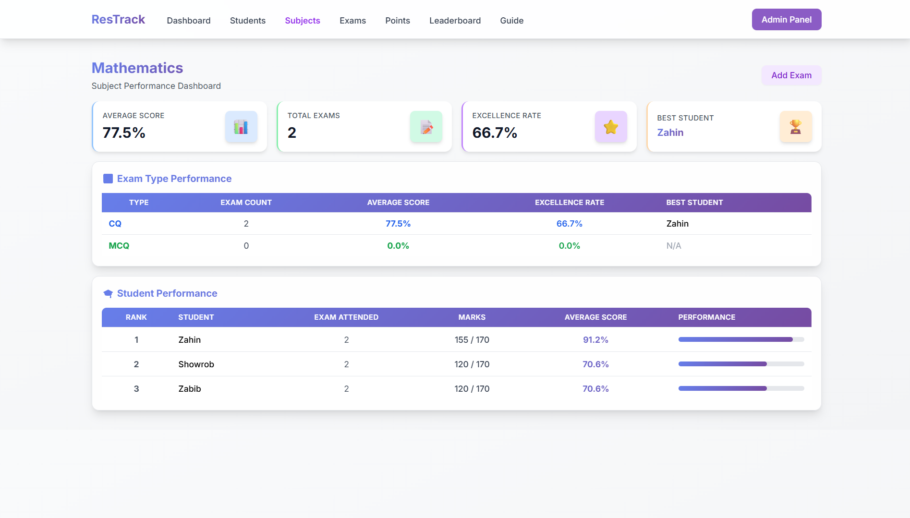

🧪 Exams
View, add, and manage exams:
•	Exam details: student, subject, type, date, chapter, marks
•	Automatic grade and points calculation
How it works:
Record new exam results, review past exams, and see how grades and points are assigned.

**Screenshots:**
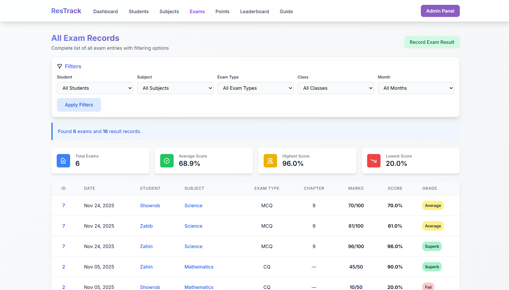
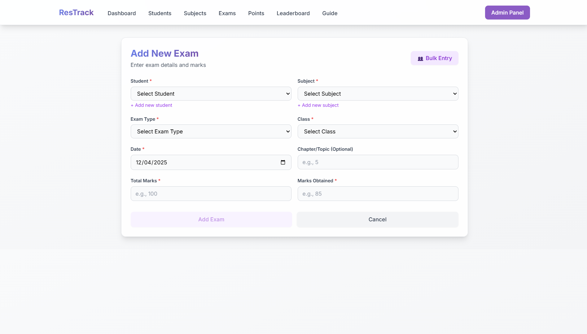

🏆 Leaderboards
Multiple ranking systems:
•	Overall Leaderboard – Ranks all students by Average Score
•	Subject Leaderboard – Highlights top performers in each subject
•	Monthly Top Performers – Showcases the top three students for every month
How it works:
Motivate students by showing top performers and progress over time.

**Screenshots:**
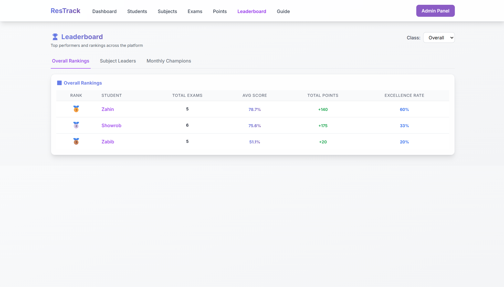
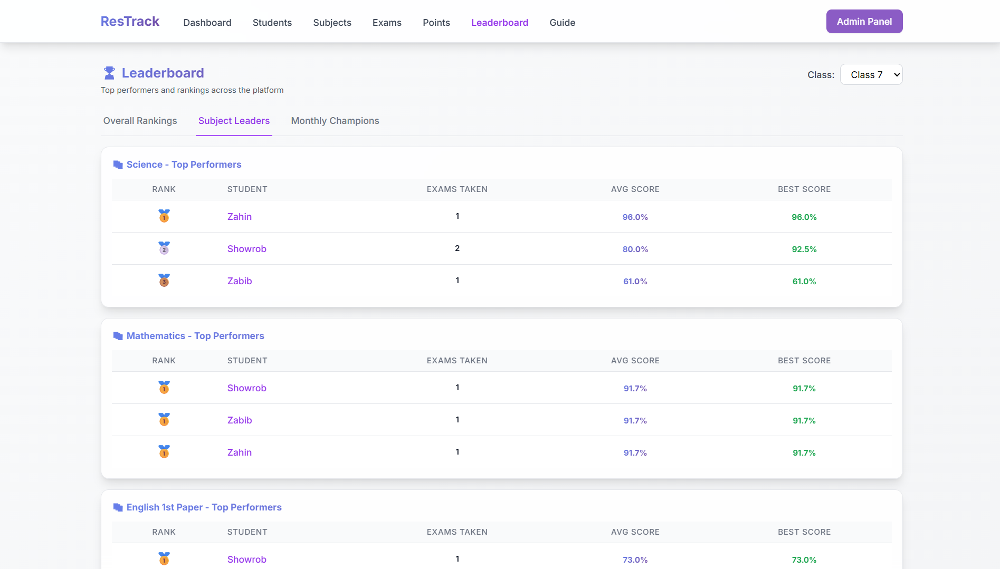
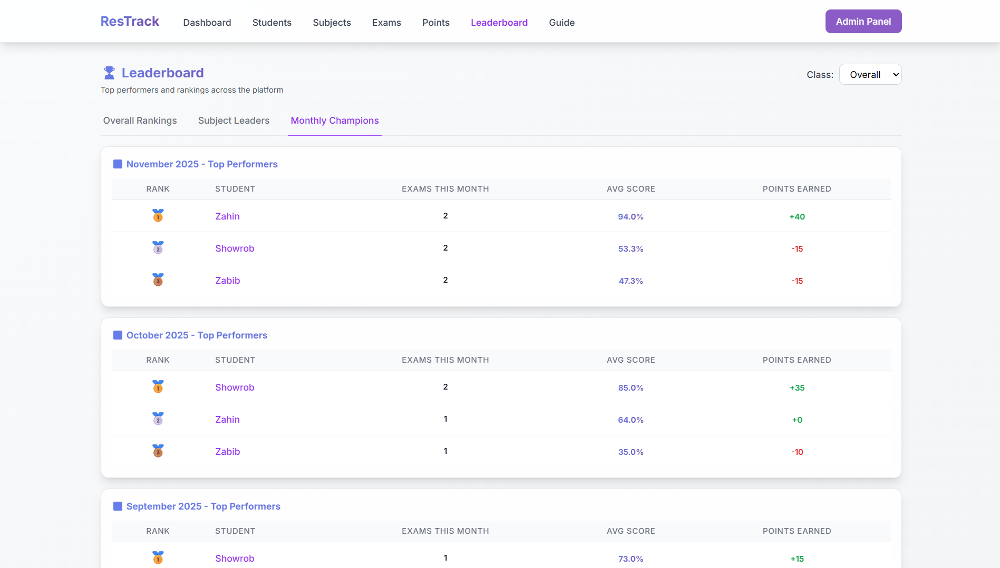

📈 Analytics & Charts
Interactive charts throughout the app:
•	Marks over time
•	Grade distribution
•	Subject performance
•	Student comparison
How it works:
Visualize data for deeper insights and easier decision-making.

**Screenshots:**

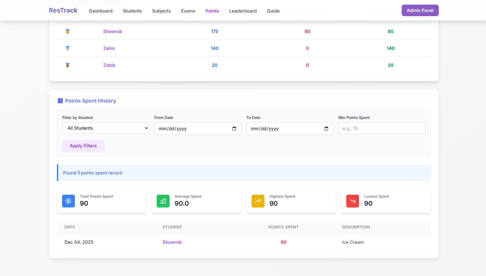
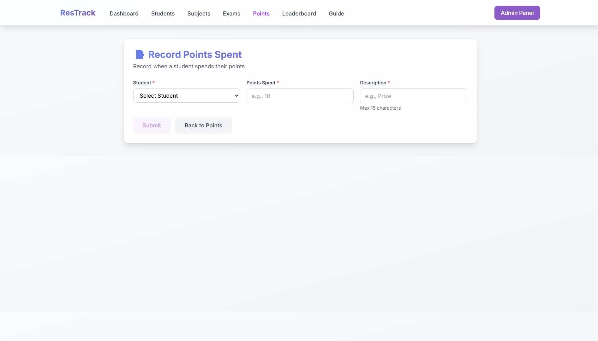

---

## 🛠️ Admin Panel

The admin panel provides full control over all data in the system. Administrators can add, edit, and delete records for every table, perform bulk operations, and use advanced filtering and search features. This is the central place for managing students, subjects, exams, and more.

**Database Tables:**
- Student
- Subject
- ExamType
- Exam
- GradeScale
- LifetimePoints

**Screenshot:**
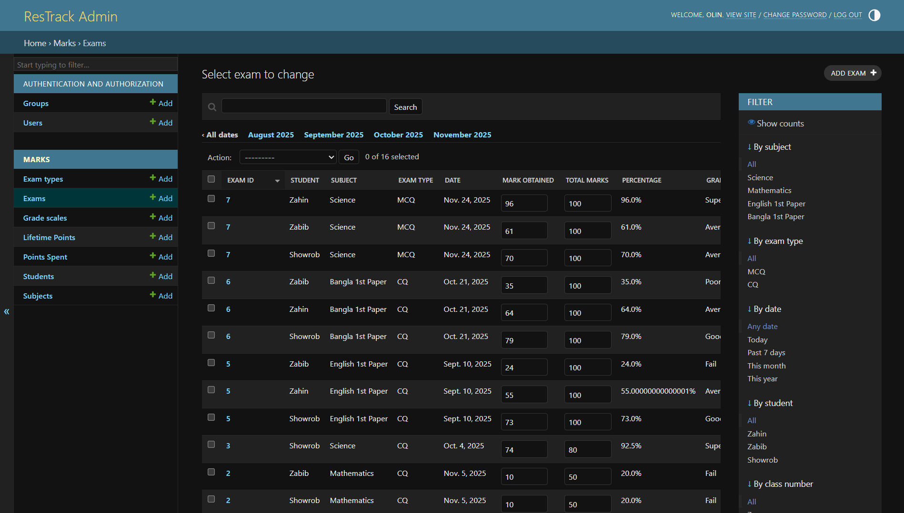

